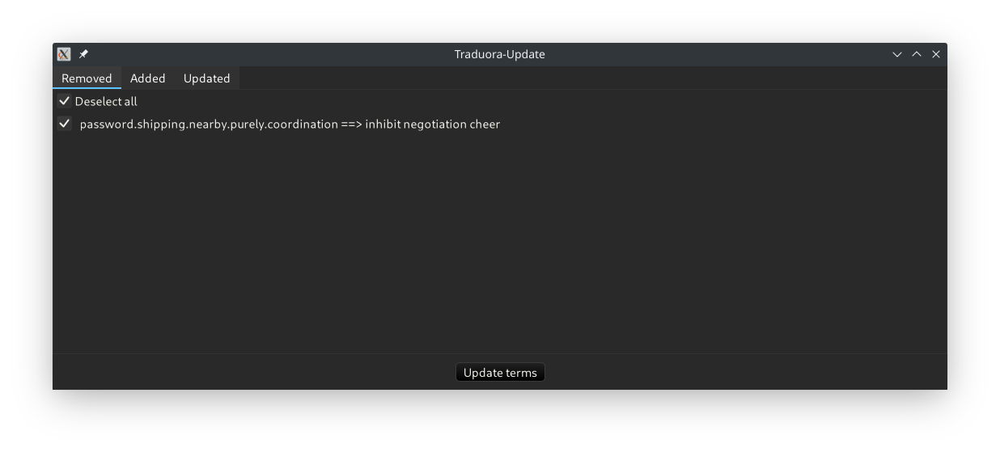
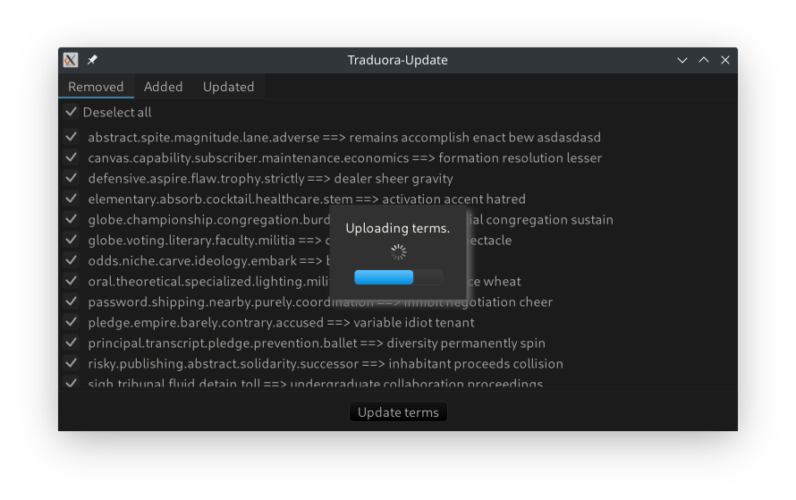

# Traduora-Update

This application allows the automatic update of [Traduora](https://traduora.co/) terms from a local translation file to a Traduora instance.




Only the terms that are selected are updated.

## Configuration

Configuration happens via JSON file. It takes the following form:
```jsonc
{
	"$schema": "http://raw.githubusercontent.com/ede1998/traduora-update/master/traduora-update.schema.json",
	"host": "localhost:8080", // URL to access the Traduora instance
	"mail": "test@test.test", // user account for Traduora login
	"password": "12345678", // password for Traduora login
    // alternatively, you can use client_id and client_password to use Traduora-Clients instead of users

	"project_id": "92047938-c050-4d9c-83f8-6b1d7fae6b01", // project that should be updated
	"translation_file": "testdata/en.json", // path that contains the translations. Should be formatted like JSON-flat export of Traduora. Relative path from working directory.
	"locale": "en", // locale to update
	"encoding": { // The entire block as well as both properties on their own are optional. If omitted, the tool tries to determine the encoding automatically via its byte order mark or just assumes UTF-8 on failure.
		"local": "utf-16", // encoding of file stored in local file system
		"git": "utf-8" // encoding of file stored in git
	}

	"with_ssl": true, // whether the connection to the server should be encrypted. Defaults to true.
	"validate_certs": true, // whether the encryption certificates should be validated. Defaults to true.

	"revision": "main" // git revision to use for sanity checks to prevent wrongly changing terms. Can be any valid revision, e.g. commit hash, tag, branch. Should usually be your default branch. If omitted, sanity checks are skipped.
}
```

The configuration file is discovered using a fallback strategy:

1. Check first command line argument for configuration file path
2. Check environment variable `TRADUORA_UPDATE_CONFIG` for configuration file path
3. Recursively ascend directories from working directory and look for file `traduora-update.json`

You can generate the JSON schema file yourself by calling the tool with the correct parameters:
```bash
$ traduora-update --generate-config-schema /path/to/schema/to/be/created.schema.json
```

## How does it work?

The programm queries the Traduora instance and fetches all terms and their translations for the given locale.
It also parses the local translation file. By comparing both results, it can determine, which term was added,
removed or just updated. When the user presses the update button, the updates are sent to Traduora one by one.

If a revision exists in the configuration, the program also performs some sanity checks to prevent tempering changes
made by other Traduora users. It reads the translation file at the given revision (equivalent to `git show $revision:$translationfile`).
Then a term is only proposed for addition if it did not exist at the revision because otherwise it was deleted by another user,
a term is only proposed for deletion if it existed at the revision because otherwise it's a new term added by another user,
a term is only proposed for update if its translation has changed since the revision otherwise another user changed the translation.
